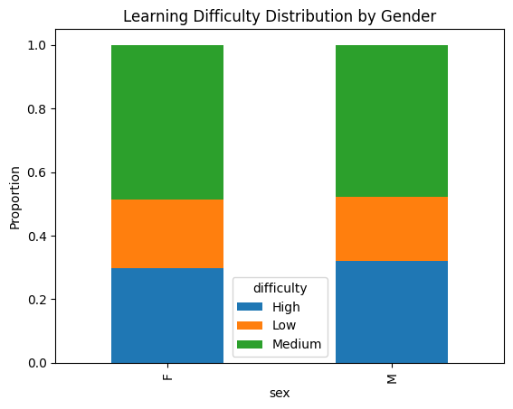
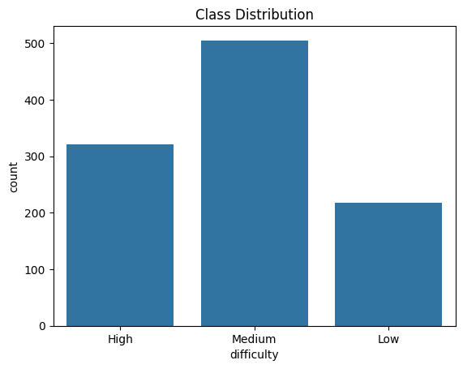
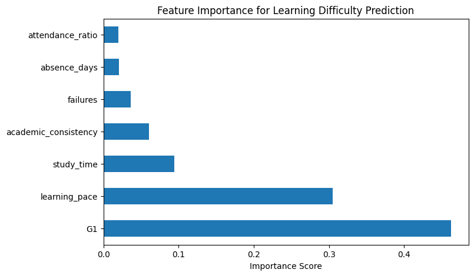

# Adaptive-Learning-Difficulty-Predictor
Students often struggle with one-size-fits-all education systems that ignore individual differences. This project proposes a machine learning–based adaptive learning system that predicts students’ learning difficulty levels and recommends personalized learning strategies.

In many traditional education systems, students are taught in the same way, even though people learn very differently. Because of this, students who struggle are often noticed only after their performance drops a lot. The goal of this project is to deal with that problem by building a machine learning–based adaptive learning system that predicts a student’s learning difficulty and suggests learning strategies that fit their needs.

The project uses a real Student Performance dataset from Kaggle, which includes academic, demographic, and behavioral data for students taking Portuguese and Mathematics courses. After combining both datasets, the final data contains 1,044 students with 33 features, such as exam scores (G1, G2, G3), study time, absences, and past failures.

To make prediction easier, an average academic score is calculated using G1, G2, and G3. Based on this score, students are grouped into Low, Medium, or High learning difficulty levels. In addition to the original features, some behavioral features are created, like learning pace, attendance ratio, and academic consistency. These features help describe how students learn, not just how they perform on exams.

Two models are trained and compared. Logistic Regression is used as a baseline because it is simple and easy to interpret. Random Forest is used as the main model since it can handle more complex patterns in the data. The Random Forest model performs better overall and gives balanced results across all difficulty levels.

The project also looks at fairness by checking how predictions are distributed across genders. The results do not show any major imbalance, which suggests the model does not introduce clear gender bias.

An early warning model is also built using only early indicators like study time, absences, failures, and the first exam score. This allows the system to identify students who may need support before final exam results are available.

📈 Results and Visualizations

### Learning Difficulty Distribution
This figure shows how students are distributed across Low, Medium, and High difficulty levels.

### Class Distribution

### Feature Importance (Random Forest)
This plot highlights which features most influence the prediction.

### Confusion Matrix
This confusion matrix shows the model’s classification performance.
.png)

### Learning Curve
.png)

📊 Dataset
- Source: Kaggle – Student Performance Dataset  
- Courses: Portuguese and Mathematics  
- Total Records: 1,044 students  
- Features include:
  - Academic scores (G1, G2, G3)
  - Study time, absences, failures
  - Demographic and behavioral attributes

⚙️ Feature Engineering
To better represent student learning behavior, the following features were created:
- **Learning Pace**: Average score relative to study time  
- **Attendance Ratio**: Measure of class attendance consistency  
- **Academic Consistency**: Variation across exam scores  

These features help the model move beyond raw grades.

🤖 Models Used
- **Logistic Regression** – baseline and interpretable model  
- **Random Forest** – final model used due to superior performance  

Model Performance (Random Forest)
- Accuracy: ~98%
- Strong and balanced precision, recall, and F1-scores
- Handles non-linear relationships effectively

⚖️ Bias & Fairness Check
Prediction distributions were analyzed across gender groups to check for potential bias. The results did not show significant disparities, indicating fair treatment across groups.

🚨 Early Warning System
An additional model was trained using only early academic indicators such as study time, absences, failures, and first exam score (G1). This allows early identification of students who may need academic support.

🎯 Output
For a given student, the system provides:
- Predicted learning difficulty (Low / Medium / High)
- Prediction confidence score
- Recommended learning strategy:
  - **Low**: Advanced content with self-paced learning
  - **Medium**: Visual aids and regular practice sessions
  - **High**: Simplified content and one-on-one support

🛠️ Tools & Technologies
- Python
- NumPy, Pandas
- Scikit-learn
- Matplotlib, Seaborn
- Google Colab

🔮 Future Work
- Incorporate formal fairness metrics
- Extend predictions across multiple semesters
- Deploy the model as a web-based dashboard for educators

📁 Files
- `Learning Difficulty Prediction.ipynb` – Complete implementation and analysis

Team Members - 
A. Tejas Attarde
B. Yash Valsangkar
C. Ehteshaam Siddiqui
